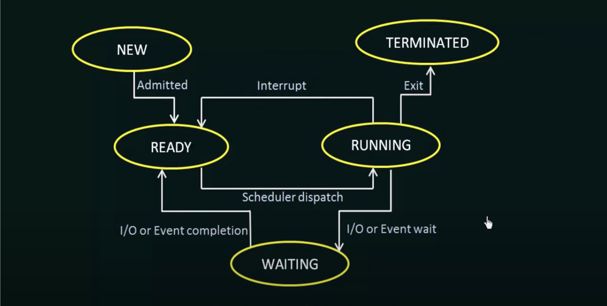

# This project aims to introduce the UNIX system - pipes and redirection.

I. Important keywords:
  * Process:
    A process refers to an executing program in computer memory.  
In most operating systems, the execution of a process is in five different stages: start, ready, running, waiting, and terminated. To execute a process in a computer system, resources such as memory, CPU time, and input-output (I/O) devices are needed.
* Process State: 
	

2. Useful resources:
	* Understanding OS, Process, Fork() etc ... :
	   * https://youtube.com/playlist?list=PLBlnK6fEyqRiVhbXDGLXDk_OQAeuVcp2O